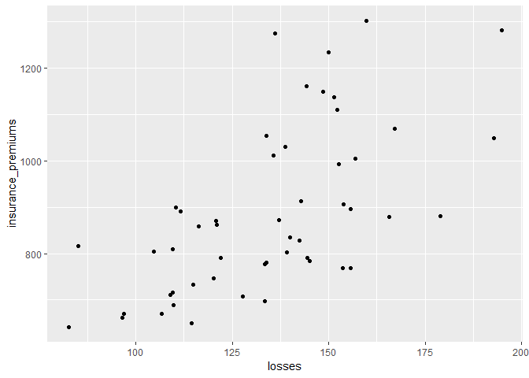
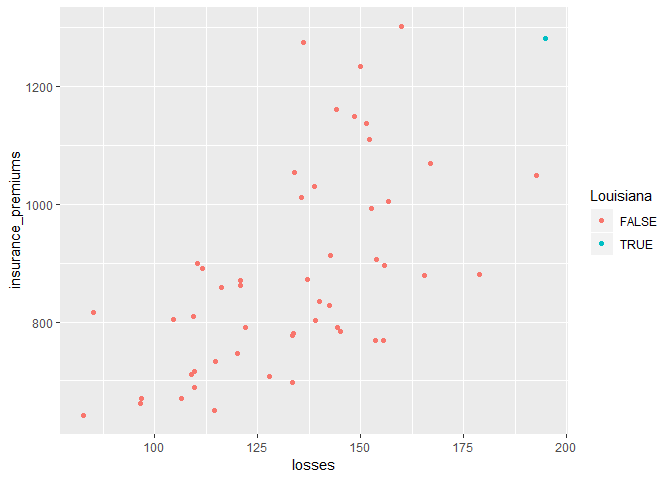
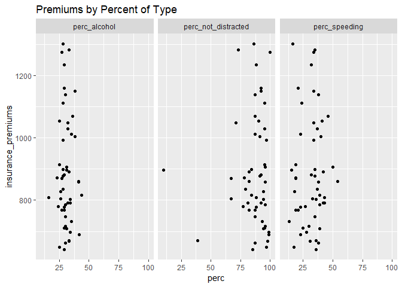

Assignment 3
================

For this assignment we are using a dataset from the website [Fivethirtyeight](http://fivethirtyeight.com/). All these datasets are available on their [GitHub page](https://github.com/fivethirtyeight/data/) and in the `fivethirtyeight` package.

1.  Install and load the `fivethirtyeight` library. For this assigment we are using the dataset `bad_drivers`.

``` r
if (!require(fivethirtyeight)) {install.packages('fivethirtyeight')}
library(fivethirtyeight)
```

1.  In the narrative, add a brief description (`?bad_drivers` for a description of the dataset) using *inline code* to show the variable names.

##### The *bad\_drivers* data frame has the following variables:

##### state, num\_drivers, perc\_speeding, perc\_alcohol, perc\_not\_distracted, perc\_no\_previous, insurance\_premiums, losses

1.  Plot a dot chart of premiums by losses. Map the count of drivers to the size of the dots.

``` r
ggplot(data=bad_drivers, aes(x = losses, y = insurance_premiums)) +
  geom_point()
```



1.  Test what values from `state` are equal to "Louisiana" and assign the output to a new variable called \`Louisiana' (logical)

``` r
Louisiana <- bad_drivers$state == "Louisiana"
```

1.  Map the variable "Louisiana" to `color`. That way, the dot referring to Louisiana should have a different color.

``` r
ggplot(data=bad_drivers) +
  geom_point(aes(x = losses, y = insurance_premiums, color=Louisiana))
```



1.  In your narrative, use inline code to report the average insurance premium and count of losses in US, and the premium and losses in Louisiana. Do not type those values manually, but extract them from the dataset using inline code.

##### In the U.S. the average insurance premium are 886.9576471 and the average count of losses is 134.4931373.

##### In Louisiana the insurance premiums are 1281.55 and the count of losses 194.78.

1.  Report in a tabular format the 5 states with the highest premiums (include only state and insurance\_premiums)

``` r
kable(head(bad_drivers[order(-bad_drivers$insurance_premiums),c("state", "insurance_premiums")],5))
```

| state                |  insurance\_premiums|
|:---------------------|--------------------:|
| New Jersey           |              1301.52|
| Louisiana            |              1281.55|
| District of Columbia |              1273.89|
| New York             |              1234.31|
| Florida              |              1160.13|

1.  Reshape the dataset gathering together perc\_speeding, perc\_alcohol, perc\_not\_distracted in one variable, paired with their pecentages. Name this variable "ViolationType" and the variable for the value pairs "perc".

``` r
gather(bad_drivers, key = "ViolationType", value = "perc", perc_speeding, perc_alcohol, perc_not_distracted) %>%
  head() %>%
  kable()
```

| state      |  num\_drivers|  perc\_no\_previous|  insurance\_premiums|  losses| ViolationType  |  perc|
|:-----------|-------------:|-------------------:|--------------------:|-------:|:---------------|-----:|
| Alabama    |          18.8|                  80|               784.55|  145.08| perc\_speeding |    39|
| Alaska     |          18.1|                  94|              1053.48|  133.93| perc\_speeding |    41|
| Arizona    |          18.6|                  96|               899.47|  110.35| perc\_speeding |    35|
| Arkansas   |          22.4|                  95|               827.34|  142.39| perc\_speeding |    18|
| California |          12.0|                  89|               878.41|  165.63| perc\_speeding |    35|
| Colorado   |          13.6|                  95|               835.50|  139.91| perc\_speeding |    37|

1.  Use facetting (DO NOT use 3 distinct calls to `ggplot()`) to plot 3 dot plots for the correlation between:

-   insurance\_premiums and perc\_alcohol
-   insurance\_premiums and perc\_speeding
-   insurance\_premiums and perc\_not\_distracted 

1.  Mute the code for both charts and add a title to both. Knit to html.
